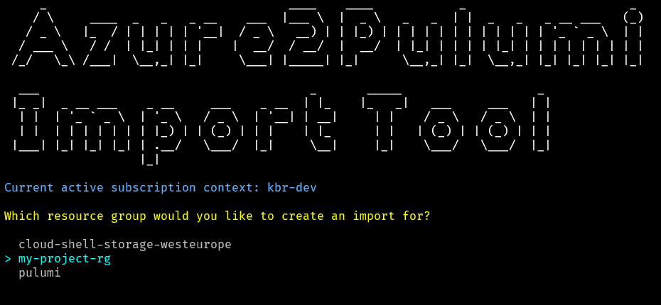

# Azure2Pulumi
An import tool that creates a Pulumi import JSON file from your existing Azure resource group. 

It currently supports [all Pulumi resources in the azure-native provider](https://www.pulumi.com/registry/packages/azure-native/api-docs/).

## Dependencies
The Azure2Pulumi tool requires you to have the [Azure CLI](https://learn.microsoft.com/en-us/cli/azure/install-azure-cli) installed. 

## How it works:

Select the subscription context your resource group belongs to. If you do not have a azure context with subscriptions, it will prompt you to log in via a browser.


You then select between the available resource groups within that subscription



This will show you all the resources belonging to that resource group. You can then choose to create an import of all resources or select the resources you want to import.


Once you have selected the resources you want to import, you can either create a single Pulumi import JSON file with all resources or split the resources into one file per resource root type.

It will then create the import json file that you now can use directly with Pulumi.

```json
{
  "resources": [
    {
      "name": "my-keyvault-kv",
      "type": "azure-native:keyvault:Vault",
      "id": "/subscriptions/12345/resourceGroups/my-project-rg/providers/Microsoft.KeyVault/vaults/my-keyvault-kv",
      "version": null,
      "logicalName": "my-keyvault-kv"
    },
    {
      "name": "mystorageaccsa",
      "type": "azure-native:storage:StorageAccount",
      "id": "/subscriptions/112345/resourceGroups/my-project-rg/providers/Microsoft.Storage/storageAccounts/mystorageaccsa",
      "version": null,
      "logicalName": "mystorageaccsa"
    },
    {
      "name": "my-namespace-ns",
      "type": "azure-native:servicebus:Namespace",
      "id": "/subscriptions/12345/resourceGroups/my-project-rg/providers/Microsoft.ServiceBus/namespaces/my-namespace-ns",
      "version": null,
      "logicalName": "my-namespace-ns"
    },
    {
      "name": "encryption-key",
      "type": "azure-native:keyvault:Key",
      "id": "/subscriptions/12345/resourceGroups/my-project-rg/providers/Microsoft.KeyVault/vaults/my-keyvault-kv/keys/encryption-key",
      "version": null,
      "logicalName": "encryption-key"
    },
    {
      "name": "my-secret",
      "type": "azure-native:keyvault:Secret",
      "id": "/subscriptions/12345/resourceGroups/my-project-rg/providers/Microsoft.KeyVault/vaults/my-keyvault-kv/secrets/my-secret",
      "version": null,
      "logicalName": "my-secret"
    },
    {
      "name": "my-topic-listen",
      "type": "azure-native:servicebus:NamespaceAuthorizationRule",
      "id": "/subscriptions/12345/resourceGroups/my-project-rg/providers/Microsoft.ServiceBus/namespaces/my-namespace-ns/AuthorizationRules/my-topic-listen",
      "version": null,
      "logicalName": "my-topic-listen"
    },
    {
      "name": "RootManageSharedAccessKey",
      "type": "azure-native:servicebus:NamespaceAuthorizationRule",
      "id": "/subscriptions/12345/resourceGroups/my-project-rg/providers/Microsoft.ServiceBus/namespaces/my-namespace-ns/AuthorizationRules/RootManageSharedAccessKey",
      "version": null,
      "logicalName": "RootManageSharedAccessKey"
    },
    {
      "name": "my-queue",
      "type": "azure-native:servicebus:Queue",
      "id": "/subscriptions/12345/resourceGroups/my-project-rg/providers/Microsoft.ServiceBus/namespaces/my-namespace-ns/queues/my-queue",
      "version": null,
      "logicalName": "my-queue"
    },
    {
      "name": "my-topic",
      "type": "azure-native:servicebus:Topic",
      "id": "/subscriptions/12345/resourceGroups/my-project-rg/providers/Microsoft.ServiceBus/namespaces/my-namespace-ns/topics/my-topic",
      "version": null,
      "logicalName": "my-topic"
    },
    {
      "name": "my-container",
      "type": "azure-native:storage:BlobContainer",
      "id": "/subscriptions/12345/resourceGroups/my-project-rg/providers/Microsoft.Storage/storageAccounts/mystorageaccsa/blobServices/default/containers/my-container",
      "version": null,
      "logicalName": "my-container"
    },
    {
      "name": "my-queue",
      "type": "azure-native:storage:Queue",
      "id": "/subscriptions/12345/resourceGroups/my-project-rg/providers/Microsoft.Storage/storageAccounts/mystorageaccsa/queueServices/default/queues/my-queue",
      "version": null,
      "logicalName": "my-queue_1"
    }
  ]
}
```

After creating the import JSON file, you:

1. Create a new Pulumi stack or use an existing one to hold the resources you want to import
2. In a command prompt, run the command 
```pulumi import -f <my-import-filename.json>``` against the selected stack;
3. Copy the generated code from the import command and paste it into your Pulumi stack

Read more about [Pulumi Import here](https://www.pulumi.com/docs/cli/commands/pulumi_import/)


## How to run
Build the projects and run the Azure2Pulumi.Console project.
You can run it in debug mode from your IDE or run ```dotnet run ``` in the Azure2Pulumi.Console project folder.

### Color Schemes
The application has two color schemes; one for a dark terminal and one for a light terminal.

Run the application with ``` dotnet run --color-scheme SCHEME_NAME ``` where 
|**SCHEME_NAME**|**Description**|
|--|--|
| dark | intended for a console with dark background color (default) |
| light | Intended for a console with light background color|

If you want to create your own color scheme, you can do this by creating a new class that inherites from the abstract class ColorScheme  in the folder ColorSchemes in the project Azure2Pulumi.Console.